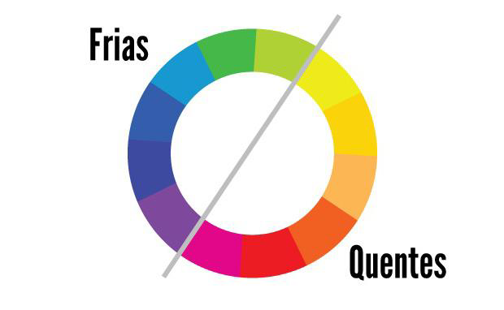
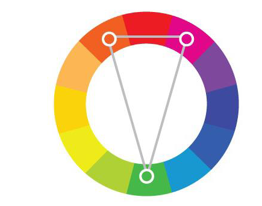

# Teoria das cores

Cores são aplicadas propositalmente na maioria dos casos, a cor vermelha por exemplo disperta fome

O olho humano enxerga as cores como frequência

## Cores primárias, secundárias e terciárias

a cor preta absorve toda a luz
a cor branca reflete toda a luz
As outras cores refletem o que o ser humano enxerga

1. Cores primárias para design digital
    - Vermelho (R)
    - Verde (G)
    - Azul (B)
    A partir dessas cores todas as cores são criadas

    A partir da soma das cores, temos outras cores

    Para impressão são usadas as cores Vermelho, azul e amarelo

2. Cores secundárias

    São a soma de duas cores primárias

    Priopriedade das cores:
    Matiz (nome)
    Saturação (nível de cinza na cor)
    brilho (luminosidade)
    Cor pura (sem saturação)
    
    Temeratura das cores:
        
        Cores quentes e frias dispertam diferentes desejos e interesses

3. COres complementares

    A cor complementar de uma primária é a soma das duas outras primárias em proporções iguais, ou seja, uma secundária

    
    
Existem 16~ milhões de core

# Trabalho

1. 

Três fontes com e sem serifa
Palavra: Desenvolvimento de sistemas

Desenvolvimento de Sistemas - Arial
Desenvolvimento de Sistemas - -----
Desenvolvimento de Sistemas - -----

Desenvolvimento de sistemas - Times new roman
Desenvolvimento de sistemas - ---------------
Desenvolvimento de sistemas - ---------------

2. Sites antes e dps